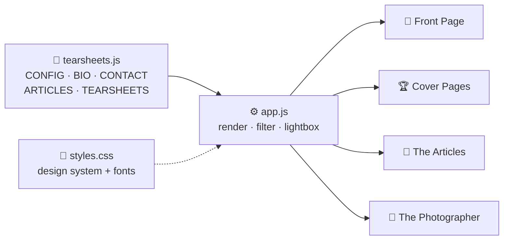

<div align="center">

# 🗞 The Tearsheet Archives of Brian Otieno

**A static, front-end-only web archive of editorial photojournalism —
print spreads, cover pages & front-page features, laid out like a classic broadsheet.**

<br>


**🌐 [tearsheets.pages.dev](https://tearsheets.pages.dev/)** &nbsp;·&nbsp; **📷 [storitellah.com](https://storitellah.com)** &nbsp;·&nbsp; **📸 KiberaStories**

</div>

---

## 📖 At a glance

> One HTML page. Zero backend. Open it and the whole archive assembles itself from a single
> data file. Every clipping links to its original story where one is known.

```
┌──────────────────────────────────────────────────────────────┐
│                 THE TEARSHEET ARCHIVES                        │  ← masthead
├──────────────────────────────────────────────────────────────┤
│  FRONT PAGE · COVER PAGES · THE ARTICLES · THE PHOTOGRAPHER   │  ← tabs
├──────────┬──────────────────────────────────────┬────────────┤
│ TIMELINE │            LEAD STORY                 │  PHOTO-     │
│  2026    │  ┌────────────┐  Headline …           │  GRAPHER    │
│  2025    │  │   image    │  dateline · excerpt   │  bio · stats│
│  …       │  └────────────┘                       │  contact    │
│ OUTLETS  │  ── clippings grid (masonry) ──       │  profiles   │
│  filters │  [img][img][img][img][img][img]       │             │
└──────────┴──────────────────────────────────────┴────────────┘
     left rail            centre well               right rail
```

## 🧭 Four ways in

| Tab | What it shows |
|:--|:--|
| 📰 **Front Page** | A lead story + a masonry grid of **all 256 tearsheets**, each at its true aspect ratio |
| 🏆 **Cover Pages** | **112** cover & front-page appearances |
| 🔗 **The Articles** | **25** published stories as clickable links to the originals |
| 👤 **The Photographer** | Biography, career highlights & full contact card |

## ✨ Features

| | |
|:--:|:--|
| 🎞 | **Broadsheet design** — warm masthead, column rules, editorial serifs, oxblood kickers |
| 🕰 | **Timeline + outlet filters** — narrow the archive by year or publication instantly |
| 🖼 | **True aspect ratios** — every clipping keeps its original proportions, never cropped |
| ⚡ | **Instant lightbox** — opens with the cached thumbnail, then swaps in the hi-res image |
| 📱 | **Fully responsive** — three columns on desktop, a clean single column on phones |
| 🔌 | **No backend, no build** — vanilla JS + self-hosted fonts, deploys as static files |

## 📊 By the numbers

```
Tearsheets   ████████████████████████████  256
Cover pages  ████████████                   112
Outlets      ██████                          26
Articles     ██                              25
Span         2017 ──────────────────────▶ 2026
```

## 🗂 Project map



| File | Role |
|:--|:--|
| `index.html` | Page skeleton |
| `styles.css` | Design system — self-hosted `@font-face`, re-skin from the `:root` variables |
| `tearsheets.js` | **The data** — `CONFIG`, `BIO`, `CONTACT`, `ARTICLES`, `TEARSHEETS` |
| `app.js` | Rendering, filtering, tabs & the lightbox |
| `fonts/` | Editorial serif + sans typefaces (`.ttf`) |
| `favicon.svg` | `BO` monogram |

## 🚀 Quick start

```bash
python3 -m http.server 8000    # → http://localhost:8000
```

## ✏️ Add or edit a tearsheet

Everything lives in **`tearsheets.js`** — copy one block inside the `TEARSHEETS` array:

```js
{
  id: "example-2025",
  title: "Cover Story: Title Here",
  outlet: "The Guardian",
  date: "2025-11-14",           // drives the timeline & sorting
  page: "Front Page",
  category: "Foreign Affairs",
  cover: true,                  // show under the “Cover Pages” tab
  summary: "Brief synopsis of the photo feature…",
  imageUrl: "https://drive.google.com/file/d/FILE_ID/view?usp=sharing",
  articleUrl: "https://…"       // optional — links to the original story
}
```

> 🖇 **Google Drive images** — paste the normal *Share* link; it is converted to a
> hot-linkable image automatically. For images to appear, set each file's sharing to
> **“Anyone with the link.”** Local paths and direct URLs work too.

---

<div align="center">
<sub>All photographs © Brian Otieno, and their respective photographers and publications. Set for archival &amp; portfolio use.</sub>
</div>
